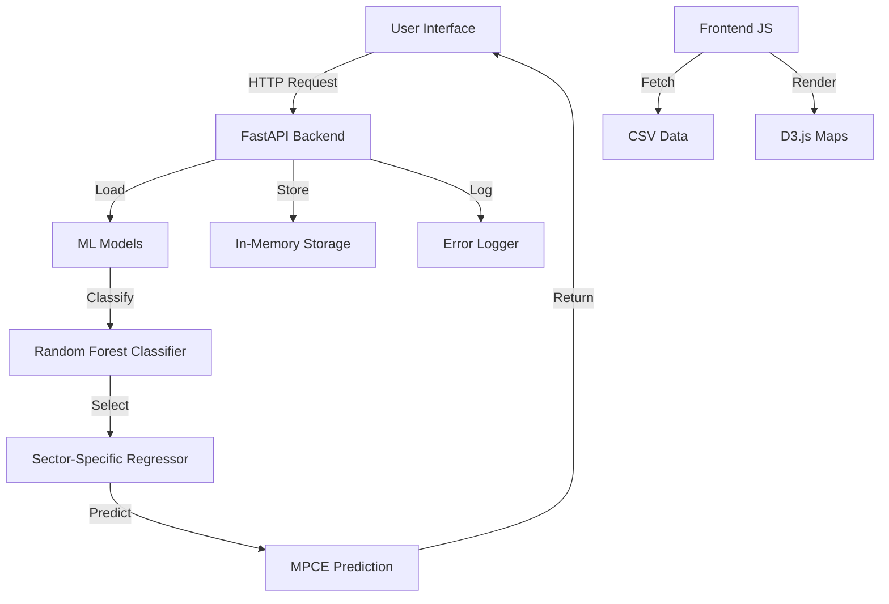

# 🏠 Household Consumption Expenditure (HCE) Forecasting System

<div align="center">


**A cutting-edge machine learning application for predicting household consumption expenditure across Indian states**

[Features](#-features) • [Demo](#-demo) • [Installation](#-installation) • [Usage](#-usage) • [API Reference](#-api-reference) • [Contributing](#-contributing)

</div>

---

## 📋 Table of Contents

- [Overview](#-overview)
- [Features](#-features)
- [Demo](#-demo)
- [Installation](#-installation)
- [Usage](#-usage)
- [API Reference](#-api-reference)
- [Data Structure](#-data-structure)
- [Model Details](#-model-details)
- [Contributing](#-contributing)

---

## 🎯 Overview

The **Household Consumption Expenditure (HCE) Forecasting System** is a comprehensive web application that combines machine learning with interactive data visualization to predict and analyze household consumption patterns across India. Built with FastAPI backend and vanilla JavaScript frontend, it provides both household-level predictions and state-level forecasting visualizations.

### Why This Project?

- 📊 **Data-Driven Insights**: Leverages ML models trained on extensive household survey data
- 🗺️ **Geographic Analysis**: Interactive choropleth maps for state-wise MPCE visualization
- 🎯 **Dual Prediction System**: Supports both individual household and aggregate state-level predictions
- 🚀 **Production Ready**: Clean architecture, validation, and error handling

---

## ✨ Features

### 🏡 Household-Level Predictions
- **Interactive Survey Form**: Comprehensive questionnaire covering demographics, employment, assets, and consumption patterns
- **Real-Time Validation**: Client-side and server-side validation ensures data quality
- **ML-Powered Predictions**: Advanced Random Forest models provide accurate expenditure forecasts
- **Instant Results**: Get predicted monthly household expenditure in seconds

### 🗺️ State-Level Analysis
- **Dynamic Choropleth Maps**: Visualize MPCE (Monthly Per Capita Expenditure) across Indian states
- **Multi-Year Comparison**: Compare data across years (2022-23, 2023-24)
- **Sector-Based Analysis**: Separate rural and urban sector insights
- **Interactive Tooltips**: Hover over states for detailed information
- **Error Analysis**: View absolute error percentages between actual and predicted values

### 🛠️ Technical Features
- **RESTful API**: Clean, documented API endpoints
- **Asynchronous Processing**: Efficient model loading and prediction
- **Error Logging**: Admin panel for monitoring failed submissions
- **Responsive Design**: Works seamlessly on desktop and mobile devices
- **Modular Architecture**: Easily extensible codebase

---

## 🎬 Demo

### Household Prediction Interface
<div align="center">

</div>

### State-Level MPCE Maps
<div align="center">

</div>

---

## 🏗️ Architecture

### System Architecture



### Technology Stack

**Backend:**
- FastAPI (Web Framework)
- scikit-learn (ML Models)
- pandas & numpy (Data Processing)
- joblib (Model Serialization)

**Frontend:**
- Vanilla JavaScript (ES6+)
- D3.js (Data Visualization)
- Select2 (Enhanced Dropdowns)
- AOS (Animation Library)

**ML Models:**
- Random Forest Classifiers (Sector-Specific)
- Random Forest Regressors (Group-Specific)
- StandardScaler & OneHotEncoder (Preprocessing)

---

## 🚀 Installation

### Prerequisites

- Python 3.8 or higher
- pip (Python package manager)
- Modern web browser (Chrome, Firefox, Safari, Edge)
- VS Code with Live Server extension (recommended for frontend)

### Step-by-Step Setup

1. **Clone the Repository**
   ```bash
   git clone https://github.com/Rishi52/Household-Consumption-Expense-Predictor.git
   cd Household-Consumption-Expense-Predictor
   ```

2. **Create Virtual Environment** (Recommended)
   ```bash
   python -m venv venv
   
   # Windows
   venv\Scripts\activate
   
   # Mac/Linux
   source venv/bin/activate
   ```

3. **Install Dependencies**
   ```bash
   pip install -r requirements.txt
   ```

4. **Verify ML Models**
   
   Ensure these files exist in `backend/Models/`:
   - `sector_income_model.pkl`
   - `sector_income_classifiers_tuned.pkl`

5. **Start the Backend Server**
   ```bash
   cd backend
   uvicorn app:app --reload
   ```
   
   Backend will be available at: `http://localhost:8000`

6. **Launch Frontend**
   
   Open `frontend/index.html` with Live Server or any static file server.

---

## 💻 Usage

### Household Prediction Workflow

1. **Navigate to Survey Form**
   - Click "Predict MPCE at Household Level" on the homepage

2. **Complete the Survey**
   - **Section 1**: Location details (State, District, Sector)
   - **Section 2**: Demographics (Household size, Religion, Social group)
   - **Section 3**: Employment (Industry, Occupation)
   - **Section 4**: Online purchases (Last 365 days)
   - **Section 5**: Household assets
   - **Section 6**: Metrics (Age, Gender, Education)
   - **Section 7**: Meal patterns
   - **Section 8**: Internet usage

3. **Submit & Get Results**
   - Click "Submit Response"
   - View predicted monthly household expenditure
   - Results displayed instantly with visual indicators

### State-Level Analysis Workflow

1. **Select Parameters**
   - Choose year(s): 2022-23, 2023-24
   - Select sector(s): Rural, Urban
   - Choose states or "All States"

2. **View Visualizations**
   - Interactive choropleth maps with color-coded MPCE values
   - Comparison table with actual vs predicted values
   - Absolute error percentages

3. **Interact with Maps**
   - Hover over states for detailed information
   - View legends for value ranges
   - Compare multiple years side-by-side

---

## 📡 API Reference

### Endpoints

#### `GET /`
Returns the backend landing page.

**Response:**
- HTML page

---

#### `POST /submit`
Submit household survey data.

**Request Body:**
```json
{
  "key": "current_record",
  "record": {
    "sector": 1,
    "state": 28,
    "region": 281,
    "district": 1,
    "household_type": 1,
    "religion": 1,
    "caste": 0,
    "hh_size": 4,
    "nco": 6111,
    "nic": 1111,
    "online_purchases": ["clothing", "mobile"],
    "assets": ["television", "mobile"],
    "max_age": 60,
    "min_age": 5,
    "gender_male": 2,
    "gender_female": 2,
    "gender_others": 0,
    "max_edu": 14,
    "min_edu": 7,
    "meals_daily": 3,
    "meals_school": 0,
    "meals_employer": 0,
    "meals_payment": 0,
    "meals_home": 90,
    "internet_users": 2
  }
}
```

**Response:**
```json
{
  "success": true,
  "message": "Record saved successfully."
}
```

---

#### `GET /records`
Retrieve the current stored record.

**Response:**
```json
{
  "current_record": {
    "sector": 1,
    "state": 28,
    ...
  }
}
```

---

#### `GET /process`
Process the stored record and return prediction.

**Response:**
```json
{
  "success": true,
  "result": {
    "predicted_expense": 15234.56
  }
}
```

---

#### `GET /admin/logs`
View failed submission logs (last 100 entries).

**Response:**
```json
[
  {
    "error": "Missing required fields",
    "fields": ["sector", "state"],
    "record": {...}
  }
]
```

---

## 📊 Data Structure

### Input Features (60+ features)

**Categorical Features:**
- Sector (Rural/Urban)
- State (36 states/UTs)
- NSS Region
- District
- Household Type
- Religion
- Social Group

**Numerical Features:**
- Household Size
- Age metrics (min, max, avg)
- Gender distribution
- Education levels
- Occupation codes (NCO)
- Industry codes (NIC)
- Online purchase indicators (11 categories)
- Asset ownership (12 categories)
- Meal consumption patterns
- Internet usage

### Output

- **Predicted Monthly Household Expenditure** (in ₹)

---

## 🤖 Model Details

### Classification Stage

**Model:** Random Forest Classifier (Sector-Specific)

**Configuration:**
```python
{
  'clf_rural': RandomForestClassifier(
    bootstrap=False,
    max_depth=30,
    n_estimators=200,
    random_state=42
  ),
  'clf_urban': RandomForestClassifier(
    bootstrap=False,
    max_depth=30,
    n_estimators=200,
    random_state=42
  )
}
```

**Purpose:** Classifies households into expenditure groups

---

### Regression Stage

**Model:** Random Forest Regressor (4 group-specific models)

**Configuration:**
```python
{
  'models': {
    1: RandomForestRegressor(random_state=42),
    2: RandomForestRegressor(random_state=42),
    3: RandomForestRegressor(random_state=42),
    4: RandomForestRegressor(random_state=42)
  }
}
```

**Purpose:** Predicts exact expenditure for each classified group

---

### Preprocessing

- **OneHotEncoder** for categorical variables
- **StandardScaler** for numerical variables
- **Sector-Specific Median Imputation** for missing values

---

## 🤝 Contributing

We welcome contributions! Here's how you can help:

### Reporting Bugs

1. Check if the bug has already been reported
2. Create a new issue with:
   - Clear title and description
   - Steps to reproduce
   - Expected vs actual behavior
   - Screenshots (if applicable)

### Suggesting Features

1. Open an issue with the `enhancement` label
2. Describe the feature and its benefits
3. Provide examples or mockups

### Pull Requests

1. Fork the repository
2. Create a feature branch (`git checkout -b feature/AmazingFeature`)
3. Commit changes (`git commit -m 'Add AmazingFeature'`)
4. Push to branch (`git push origin feature/AmazingFeature`)
5. Open a Pull Request

### Development Guidelines

- Follow PEP 8 for Python code
- Use ESLint standards for JavaScript
- Write clear commit messages
- Add comments for complex logic
- Update documentation as needed

---

## 🙏 Acknowledgments

- National Sample Survey Office (NSSO) for household survey data
- scikit-learn community for ML tools
- D3.js community for visualization libraries
- FastAPI community for the excellent web framework

---

<div align="center">

**⭐ Star this repository if you find it helpful!**

Made with ❤️ by Rishi52

</div>
